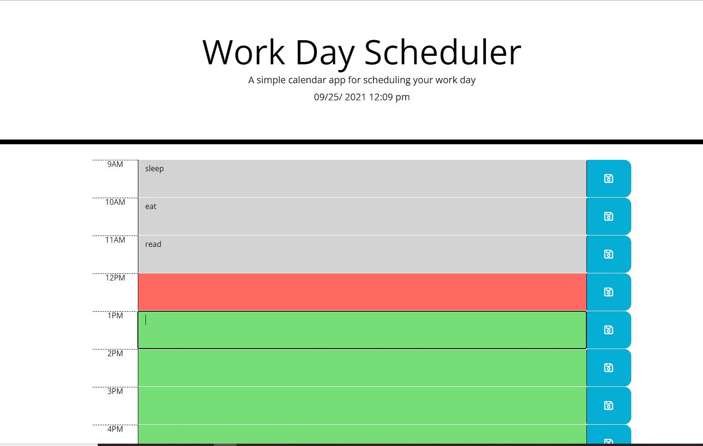

# work-planner

## Purpose: Schedulaing work day hours

### Description: 
This application allows to:
* display current time and date.
* display rext area where the user can add plan for each hour
* schedula work day hour by hour from 9 am to 5 p.m.
* If the time is past the text area for past hours display in Gray-color
* If the time is present the text area for current hour displays in Red-color
* If the time is future the text areas for future hours display in Green-color
* When the user click on save button, it will save the task that entered for the same hour.
* When the user refresh the page the new tasks witch benn added should displayed.
* When the user want to remove or update the task, the user only need to click on the targeted hour and updae or clear following to pressing the save button on the lift side of the hour.

## Instructions:
save buttons are located in the left side of each work hours 
as  following snips:

## Website
 https://ghaliarose89.github.io/password-generator/

### Contribution
Made with ❤️️ by Ghalia

### ©️ [2021] [Ghalia Sami]
