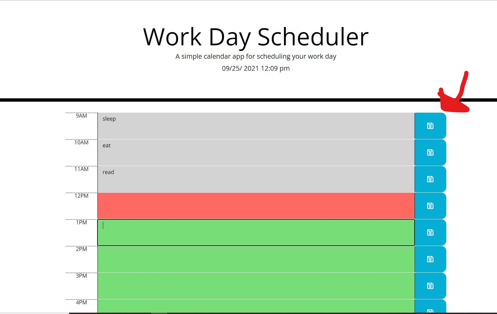

# work-planner

## Purpose: Scheduling workday hours

### Description: 
This application allows to:
* display current time and date.
* display text area where the user can add a plan for each hour
* schedule workday hour by hour from 9 am to 5 p.m.
* If the time is in the past, the text area for past hours display in Gray-color
* If the time is in the present, the text area for current hour displays in Red-color
* If the time is in the  future, the text areas for future hours display in Green-color
* When the user clicks on the save button, it will save the task that was entered for the same hour.
* When the user refreshes the page, the new tasks which have been added should be displayed.
* When the user wants to remove or update the task, the user only needs to click on the targeted hour and update or clear following to pressing the save button on the lift side of the hour.

## Instructions:
save buttons are located on the left side of each work hours 
as  following snips:

## Website
 https://ghaliarose89.github.io/work-planner/

### Contribution
Made with ❤️️ by Ghalia

### ©️ [2021] [Ghalia Sami]
